# Applied Energistics 2 - Model Class Diagram

このドキュメントには、Applied Energistics 2プロジェクトの主要なモデルクラスの関係を示すクラス図が含まれています。

```mermaid
classDiagram
    %% Core API Layer - Stack/Key System
    class AEKey {
        <<abstract>>
        +getType() AEKeyType
        +toStack(long amount) GenericStack
        +matches(AEKey other) boolean
        +fuzzyEquals(AEKey other, FuzzyMode mode) boolean
        +getDisplayName() Component
        +toTag() CompoundTag
        +hashCode() int
        +equals(Object obj) boolean
    }
    
    class AEItemKey {
        -Item item
        -DataComponentMap components
        +getItem() Item
        +getComponents() DataComponentMap
        +toStack(int amount) ItemStack
        +of(ItemStack stack) AEItemKey
        +matches(AEKey other) boolean
    }
    
    class AEFluidKey {
        -Fluid fluid
        -DataComponentMap components
        +getFluid() Fluid
        +getComponents() DataComponentMap
        +toStack(long amount) FluidStack
        +of(FluidStack stack) AEFluidKey
    }
    
    class AEKeyType {
        <<interface>>
        +getId() ResourceLocation
        +getAmountPerOperation() int
        +getAmountPerByte() int
        +getAmountPerUnit() int
    }
    
    class GenericStack {
        -AEKey what
        -long amount
        +what() AEKey
        +amount() long
        +toStack() ItemStack
        +fromItemStack(ItemStack stack) GenericStack
    }
    
    %% Storage System
    class MEStorage {
        <<interface>>
        +insert(AEKey what, long amount, Actionable mode, IActionSource source) long
        +extract(AEKey what, long amount, Actionable mode, IActionSource source) long
        +getAvailableStacks(KeyCounter out)
        +getCachedAvailableStacks() KeyCounter
        +isPreferredStorageFor(AEKey what, IActionSource source) boolean
        +getDescription() Component
    }
    
    class KeyCounter {
        -Long2ObjectMap~AEKey~ keys
        -Object2LongMap~AEKey~ amounts
        +add(AEKey what, long amount)
        +remove(AEKey what, long amount)
        +get(AEKey what) long
        +keySet() Set~AEKey~
        +size() int
        +clear()
    }
    
    %% Networking System
    class IGrid {
        <<interface>>
        +getNodes() Iterable~IGridNode~
        +getMachines() Iterable~IGridNode~
        +getService(Class~T~ iface) T
        +postEvent(GridEvent event)
        +visitAllNodes(IGridVisitor visitor) boolean
        +size() int
        +isEmpty() boolean
    }
    
    class IGridNode {
        <<interface>>
        +getGrid() IGrid
        +destroy()
        +updateState()
        +getOwner() IGridNodeService
        +setOwner(IGridNodeService owner)
        +getConnections() List~IGridConnection~
        +hasConnection(Direction dir) boolean
        +getGridColor() AEColor
        +getFlags() Set~GridFlags~
        +setPlayerID(UUID playerID)
        +getPlayerID() UUID
    }
    
    class IGridService {
        <<interface>>
        +onServerStartTick()
        +onServerEndTick()
        +addNode(IGridNode node, IGridHost machine)
        +removeNode(IGridNode node, IGridHost machine)
        +onSplit(IGrid destinationGrid)
        +onJoin(IGrid sourceGrid)
        +populateCrashReportCategory(CrashReportCategory crashReportCategory)
    }
    
    class Grid {
        -List~IGridNode~ nodes
        -Map~Class, IGridService~ services
        -GridEventBus eventBus
        +getNodes() Iterable~IGridNode~
        +getService(Class~T~ iface) T
        +addNode(IGridNode node)
        +removeNode(IGridNode node)
        +split(Collection~IGridNode~ newGrid)
        +merge(Grid otherGrid)
    }
    
    class GridNode {
        -IGridNodeService owner
        -Grid myGrid
        -Set~GridFlags~ flags
        -AEColor gridColor
        -UUID playerID
        -List~IGridConnection~ connections
        +getGrid() IGrid
        +getOwner() IGridNodeService
        +updateState()
        +addConnection(IGridConnection connection)
        +removeConnection(IGridConnection connection)
    }
    
    class GridConnection {
        -IGridNode sideA
        -IGridNode sideB
        -Direction fromAtoB
        +getOtherSide(IGridNode gridNode) IGridNode
        +getDirection(IGridNode side) Direction
        +destroy()
        +isNetworkConnection() boolean
    }
    
    %% Block Entity System
    class AEBaseBlockEntity {
        <<abstract>>
        -boolean clientSideUpdate
        -boolean hasCustomName
        -Component customName
        +markForUpdate()
        +saveClientState(CompoundTag tag, HolderLookup.Provider registries)
        +loadClientState(CompoundTag tag, HolderLookup.Provider registries)
        +getCustomName() Component
        +setCustomName(Component name)
        +addEntityCrashInfo(CrashReportCategory category)
    }
    
    class AEBaseInvBlockEntity {
        <<abstract>>
        +getInternalInventory() InternalInventory
        +onChangeInventory(InternalInventory inv, int slot)
        +getExposedInventoryForSide(Direction facing) InternalInventory
        +saveAdditional(CompoundTag tag, HolderLookup.Provider registries)
        +loadTag(CompoundTag tag, HolderLookup.Provider registries)
    }
    
    class AENetworkedBlockEntity {
        <<abstract>>
        -IManagedGridNode mainNode
        +getMainNode() IManagedGridNode
        +getGridNode(Direction dir) IGridNode
        +onReady()
        +setRemoved()
        +clearRemoved()
        +onChunkUnloaded()
        +onLoad()
    }
    
    class AENetworkedInvBlockEntity {
        <<abstract>>
        +getInternalInventory() InternalInventory
        +onChangeInventory(InternalInventory inv, int slot)
        +getExposedInventoryForSide(Direction side) InternalInventory
    }
    
    class AENetworkedPoweredBlockEntity {
        <<abstract>>
        -IAEPowerStorage internalBattery
        +getAEMaxPower() double
        +getAECurrentPower() double
        +extractAEPower(double amt, Actionable mode, PowerMultiplier multiplier) double
        +injectAEPower(double amt, Actionable mode) double
        +isNetworkRequiredPower() boolean
    }
    
    %% Services
    class StorageService {
        -MEInventoryHandler inventory
        -List~IStorageProvider~ providers
        +getInventory() MEStorage
        +addGlobalStorageProvider(IStorageProvider provider)
        +removeGlobalStorageProvider(IStorageProvider provider)
        +refreshGlobalStorageProvider(IStorageProvider provider)
        +getStorageProviders() List~IStorageProvider~
    }
    
    class EnergyService {
        -double globalMaxPower
        -double globalAvailablePower
        -double globalPowerUsage
        +extractAEPower(double amt, Actionable mode, Set~IEnergyGrid~ seen) double
        +injectPower(double amt, Actionable mode) double
        +getMaxStoredPower() double
        +getStoredPower() double
        +isNetworkPowered() boolean
    }
    
    class CraftingService {
        -Set~ICraftingProvider~ providers
        -Map~AEItemKey, List~ICraftingPatternDetails~~ patterns
        +getProviders() Collection~ICraftingProvider~
        +addProvider(ICraftingProvider provider)
        +removeProvider(ICraftingProvider provider)
        +getCraftingFor(AEKey what) Collection~ICraftingPatternDetails~
        +beginCraftingCalculation(Level level, ICraftingRequester requester, AEKey what, long amount) ICraftingPlan
    }
    
    class PathingService {
        -boolean recalculateNetwork
        -PathingCalculation lastCalculation
        +repath()
        +getChannelsInUse() int
        +getUsedChannels() int
        +getMaxChannels() int
        +isNetworkBooting() boolean
        +submitJob(PathingCalculation job)
    }
    
    %% Parts System
    class IPart {
        <<interface>>
        +getPartModel(PartModelData data) IPartModel
        +getBoxes(IPartCollisionHelper helper)
        +onActivate(Player player, InteractionHand hand, Vec3 pos) InteractionResult
        +onClicked(Player player, InteractionHand hand, Vec3 pos) boolean
        +canConnectRedstone(Direction side) boolean
        +readFromNBT(CompoundTag tag, HolderLookup.Provider registries)
        +writeToNBT(CompoundTag tag, HolderLookup.Provider registries)
        +getGridNode() IGridNode
    }
    
    class IPartHost {
        <<interface>>
        +getFacadeContainer() IFacadeContainer
        +isBlocked(Direction side) boolean
        +addPart(IPart part, Direction side) boolean
        +removePart(Direction side) IPart
        +getPart(Direction side) IPart
        +getColor() AEColor
        +clearContainer()
        +notifyNeighbors()
        +markForUpdate()
        +markForSave()
    }
    
    %% Relationships
    AEKey <|-- AEItemKey
    AEKey <|-- AEFluidKey
    AEKey --> AEKeyType : uses
    AEKey --> GenericStack : creates
    
    Grid ..|> IGrid
    GridNode ..|> IGridNode
    Grid --> GridNode : manages
    GridNode --> GridConnection : connects via
    GridConnection --> GridNode : connects
    
    IGrid --> IGridService : provides services
    StorageService ..|> IGridService
    EnergyService ..|> IGridService
    CraftingService ..|> IGridService
    PathingService ..|> IGridService
    
    StorageService --> MEStorage : manages
    MEStorage --> KeyCounter : tracks items
    KeyCounter --> AEKey : contains
    
    AEBaseBlockEntity <|-- AEBaseInvBlockEntity
    AEBaseInvBlockEntity <|-- AENetworkedInvBlockEntity
    AEBaseBlockEntity <|-- AENetworkedBlockEntity
    AENetworkedBlockEntity <|-- AENetworkedInvBlockEntity
    AENetworkedBlockEntity <|-- AENetworkedPoweredBlockEntity
    
    AENetworkedBlockEntity --> IGridNode : manages
    IGridNode --> IGrid : belongs to
    
    IPartHost --> IPart : hosts
    IPart --> IGridNode : may have
    
    class InternalInventory {
        <<interface>>
        +size() int
        +getStackInSlot(int slot) ItemStack
        +setItemDirect(int slot, ItemStack stack)
        +insertItem(int slot, ItemStack stack, boolean simulate) ItemStack
        +extractItem(int slot, int amount, boolean simulate) ItemStack
        +getSlotLimit(int slot) int
        +isItemValid(int slot, ItemStack stack) boolean
    }
    
    AEBaseInvBlockEntity --> InternalInventory : manages
    
    note for AEKey "Core abstraction for identifying\nstackable items in ME system"
    note for IGrid "Main network grid interface\nmanaging connected nodes"
    note for MEStorage "Primary storage interface\nfor ME inventories"
    note for AEBaseBlockEntity "Base class for all AE2\nblock entities"
```

## 主要なコンポーネントの説明

### 1. Core API Layer (コアAPIレイヤー)
- **AEKey**: MEシステム内でスタック可能なアイテムを識別する抽象クラス
- **AEItemKey/AEFluidKey**: アイテムと流体の具体的な実装
- **GenericStack**: アイテムと数量のペア

### 2. Storage System (ストレージシステム)
- **MEStorage**: MEインベントリの主要なインターフェース
- **KeyCounter**: アイテムの種類と数量を追跡

### 3. Networking System (ネットワークシステム)
- **IGrid**: ネットワークグリッドの主要インターフェース
- **IGridNode**: グリッド内の個別ノード
- **GridConnection**: ノード間の接続

### 4. Block Entity Hierarchy (ブロックエンティティ階層)
- **AEBaseBlockEntity**: すべてのAE2ブロックエンティティの基底クラス
- **AENetworkedBlockEntity**: ネットワーク接続機能を持つブロックエンティティ
- **AENetworkedPoweredBlockEntity**: 電力機能を持つネットワークブロックエンティティ

### 5. Services (サービス)
- **StorageService**: ストレージ管理
- **EnergyService**: エネルギー管理
- **CraftingService**: クラフティング管理
- **PathingService**: ネットワークパスの管理

### 6. Parts System (パーツシステム)
- **IPart**: ケーブルに取り付けられるパーツのインターフェース
- **IPartHost**: パーツをホストするエンティティのインターフェース